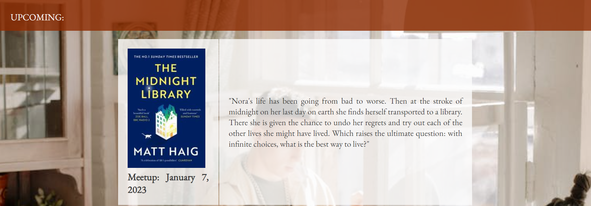

# __#Läsa - The Malmö Book Club | Portfolio Project I__

This is a website with the goal of growing a community of Malmö-based booklovers, facilitating the creation of connections by this shared passion, and last but not least, to keep literature and the importance of reading alive.

## Live Site

## Repository

https://github.com/vivienrauch/HTML-CSS-Essentials-Portfolio-Project-Book-Club

# **Objective**

My main objective of this website is to use HTML and CSS efficiently in order to create a responsive static website with pleasing aesthetics and intuitive functionality.

# __Features__

## **Existing Features**

- Logo & Navigation Bar

The responsively designed logo and navigation bar with the background image appear in all three pages of the website in order to facilitate intuitive navigation for the user.

- Quote section

The quote section is placed between the header of the page and an upcoming reads section. It mainly has decorative purposes and a function of creating a cozy atmosphere and to provide a smooth transition between the navigation section and the also busy upcoming reads section.

- Upcoming section

The upcoming section contains a snippet of the full list of reads that's planned for the book club for 2023. It serves as an appetizer for the user to get into the vibe of the community. The list contains three images with links to the online bookstore that the book club is theoretically collaborating with and a few lines about each book. That text becomes hidden in smaller screens since it becomes too busy with all the text on a mobile screen and the user can reach the same information on the bookstore's website as they click on the link.
The background image functions to present the atmosphere of the community.

- Footer

The footer contains the social links to the book club's theoretical Facebook and Instagram pages. The links open in a new tab which allows an easier navigation for the user.

- Calendar page

The calendar page contains all the technicalities the user should know about the book club. It contains information about how to join, when and where the meeetups are held. The text in italic provide links to the relevant pages for the user.

This section follows the same style as the "appetizer" section on the Home page. It contains a clickable image of the book cover and an introductory text about the book itself, as well as the date of the meetup when this read will be discussed by the members.
Just as the other section on the Home page, these texts will also be hidden on smaller screen sizes, leaving the user with a clear and relevant information about the reads and meetup dates.

The embedded responsive Google Maps provides clear information about the location of the meetings.

- Join Us page

The Join Us page allows the user to join the community of the book club. The user is asked to enter their first and last name as well as their email address.

## **Future Features**

A Blog page is left to implement where each month a member can write about their impressions and experience with our read of the month. 

## **Wireframes**
    
I used [Balsamiq](https://balsamiq.com/) to do an initial mockup of the website. The image below shows my first idea of what I wanted the Home Page to look like, which changed quite a bit as I continued the process; however, all these elements appear in a similar form on different pages.

### **Colors**

To further represent the atmosphere of a cozy environment of bookshelves, library, wood, antique bookbinds I used an earthy color palette.

In the text the three main colors are the following:

### **Fonts**

Since it's a website related to books, it was important for me to use fonts that are usually used in books as well.
Thus all text has **Eb Garamond** as font-family and the logo got **Tangerine**.
I imported these from [Google Fonts](https://fonts.google.com/).

# **Testing**

- Accessibility & Performance (Lighthouse)

    - Desktop

    

    - Mobile

    

- Validator testing

    **HTML**
        
    - **Home**
        
        The [W3C Validator](https://validator.w3.org/nu/#textarea) gave me a warning about having an empty header in the quote section. I used that header on purpose to put my [Font Awesome](https://fontawesome.com/icons/quote-right?s=solid&f=classic) quotation mark over the quote itself, so I didn't end up modifying that. Other than that it didn't find any errors.

        
    
    - **Calendar**

        The [W3C Validator](https://validator.w3.org/nu/#textarea) gave me a warning about the map section not having a heading and suggesting to use 
 instead of <section> if that part doesn't need a heading,  so I fixed that.

        Initial warning:

        

        After that it only gave me a warning about using a different type of header for the meetup information, but I intended those to be top level headers so I decided to keep them as they were.

        

    - **Join Us**

        The [W3C Validator](https://validator.w3.org/nu/#textarea) gave me no errors or warnings for the Join Us page.

        

    **CSS**

    - The [W3C (Jigsaw) CSS Validator](https://jigsaw.w3.org/css-validator/validator) found no errors.

        

# **Languages used**

- **HTML**
- **CSS**

# **Bugs**

## **Fixed bugs**

The embedded Google Maps only took up one-third of the screen, and even when I added - center center no-repeat - it got aligned to the middle but left some whitespace on the sides.

**Fix**: I removed the centering and the no-repeat constraint and set the width to 100%.

## **Unfixed bugs**

I couldn't create a responsive table, so I had to find an alternative way to create those sections responsive, which ended up being hiding or completely removing the table and replacing it with a list on smaller screen sizes.

# **Deployment**

I deployed the site to GitHub pages and the steps were the following:

- In my repository, I navigated to Settings
- From the source section I selected "main"
- Clicked on save and the page provided me with the following live link after deployment:

# **Credits**

- Media
    - [Canva](https://www.canva.com/) for resizing images and creating a montage
    - [Balsamiq](https://balsamiq.com/) for creating a wireframe mockup
    - [Pexels](https.//pexels.com/) for the images
    - [Aldibris](https://www.adlibris.com/se?gclid=Cj0KCQiA-oqdBhDfARIsAO0TrGEfuOMhq9P37s6VHWtIa2GaEHWH42dDIJy6pe6AT-TaaOVGejTTUw8aAjP_EALw_wcB) for reference and book cover images
    - [Coolors](https://coolors.co/) for the text color palette
    - [Font Awesome](https://fontawesome.com/) for the icons used throughout the site

- Content
    - https://www.w3schools.com/ for help in coding certain parts like styling tables and using flex
    - The project relies on the methods learnt through the [Love Running Walkthrough Project](https://github.com/vivienrauch/love-running).

